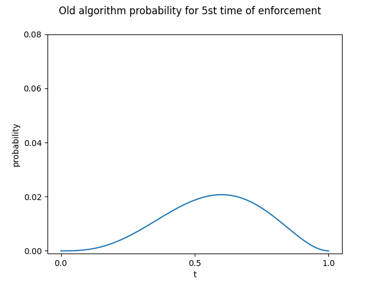
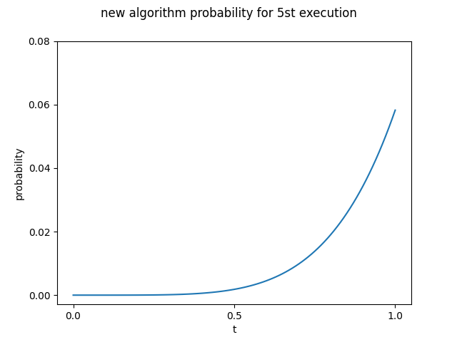

# bayes_estimation

確率ロボティクスの講義で出題されたものに関してのレポジトリになります。</br>
ベイズの定理を用いてある実験の新旧アルゴリズムを評価しました。</br>

## 実行環境

- Ubuntu 20.04LTS

## 実行方法

```
$ git clone https://github.com/kaitoyamazaki/bayes_estimation.git
$ cd src
$ python3 before_kakuritu.py    # 旧式アルゴリズムの評価
$ python3 after_kakuritu.py     # 新アルゴリズムの評価
```

## 課題の問題

ある学生A君は、ロボットをある地点からある地点まで自動で走らせるソフトウェアを改良しました。改良の効果を調べるということで、改良前後のソフトウェアで5回ずつロボットを走らせたところ、以下のような結果になりました。

- 改良前</br>
完走 → 失敗 → 失敗 → 完走 → 完走

</br>

- 改良後</br>
完走 → 完走 → 完走 → 完走 → 完走

## プログラムの説明

- [before_kakuritu](https://github.com/kaitoyamazaki/bayes_estimation/blob/master/src/before_kairyou.py)</br>
旧アルゴリズムに関してのプログラムです。実行すると1~5回までの施行時の完走率の確率とグラフを出力し、グラフを保存します。</br>
- [after_kakuritu.py](https://github.com/kaitoyamazaki/bayes_estimation/blob/master/src/after_kakuritu.py)</br>
新アルゴリズムに関してのプログラムです。実行すると1~5回までの施行時の完走率の確率とグラフを出力し、グラフを保存します。</br>


## 課題の結果

新旧アルゴリズムそれぞれの5回終了時の完走率の確率分布は以下の様になった。</br>

- 旧アルゴリズム</br>
 
