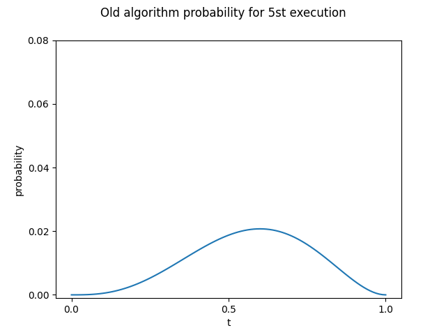

# bayes_estimation

確率ロボティクスの講義で出題されたものに関してのレポジトリになります。</br>
ベイズの定理を用いて、新旧アルゴリズムの完走率を確率的に評価しました。</br>

## 実行環境

- Ubuntu 20.04LTS

## 実行方法

```
$ git clone https://github.com/kaitoyamazaki/bayes_estimation.git
$ cd src
$ python3 before_kakuritu.py    # 旧式アルゴリズムの評価
$ python3 after_kakuritu.py     # 新アルゴリズムの評価
```

## 課題の問題

ある学生A君は、ロボットをある地点からある地点まで自動で走らせるソフトウェアを改良しました。改良の効果を調べるということで、改良前後のソフトウェアで5回ずつロボットを走らせたところ、以下のような結果になりました。

- 改良前</br>
完走 → 失敗 → 失敗 → 完走 → 完走

</br>

- 改良後</br>
完走 → 完走 → 完走 → 完走 → 完走

この結果から新アルゴリズムの方がどれだけ旧アルゴリズムより良好であるか考える。

## 実装方法

参考にさせていただいた**5章.pdf**の中の式をpythonでそのまま実装しました。</br>

## レポジトリ詳細

- [src](https://github.com/kaitoyamazaki/bayes_estimation/tree/master/src)</br>
作成したプログラムがあるフォルダーです。</br>
- [figure](https://github.com/kaitoyamazaki/bayes_estimation/tree/master/figure)</br>
出力されたグラフが保存されたフォルダーです。</br>

## プログラムの説明

- [before_kakuritu](https://github.com/kaitoyamazaki/bayes_estimation/blob/master/src/before_kairyou.py)</br>
旧アルゴリズムに関してのプログラムです。実行すると1~5回までの施行時の完走率の確率密度を出力し、グラフを保存します。</br>
- [after_kakuritu.py](https://github.com/kaitoyamazaki/bayes_estimation/blob/master/src/after_kakuritu.py)</br>
新アルゴリズムに関してのプログラムです。実行すると1~5回までの施行時の完走率の確率密度を出力し、グラフを保存します。</br>


## 課題の結果

新旧アルゴリズムそれぞれの5回終了時の完走率の確率密度のグラフは以下の様になりました。</br>
左の図が**旧アルゴリズムの結果**であり、右の図が**新アルゴリズムの結果**です。</br>

 

両者の確率密度の最大値は以下のようになる。</br>

- 旧アルゴリズム</br>
    - 完走率 : 0.6</br>
    - 確率密度 : 0.027</br>

- 新アルゴリズム</br>
    - 完走率 : 1.0
    - 確率密度 : 0.058</br>

## 考察

**こちら後ほど書き直す予定です。現在記載されているのは、過去のものです。**

- 新旧を比べると、モードの値が大きく異なっている。旧アルゴリズムは0.6となっているが、新アルゴリズムは1.0となっている。そのため新アルゴリズムは旧アルゴリズムと比較して完走できる確率が高いと考えられる。</br>
</br>

- 新旧アルゴリズムで完走率が0.5以下のときの確率を出力すると以下のような結果になった。</br>
    - 旧アルゴリズム : 0.353</br>
    - 新アルゴリズム : 0.168</br>

このことから完走できない確率は旧アルゴリズムの方が高いことがわかる。</br>

上記２点より、新アルゴリズムの方が旧アルゴリズムと比較して完走の確率が高く、完走できない確率が低いと考えられるため、新アルゴリズムの方が良いと考えられる。

## 参考文献

- 5章.pdf
- [詳解　確率ロボティクス　Ｐｙｔｈｏｎによる基礎アルゴリズムの実装](https://bookclub.kodansha.co.jp/product?item=0000276064)

